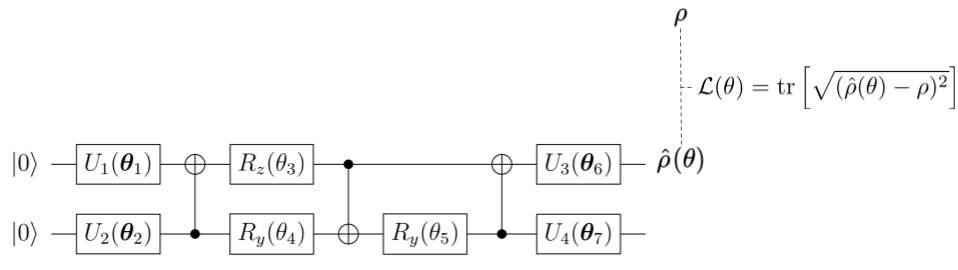
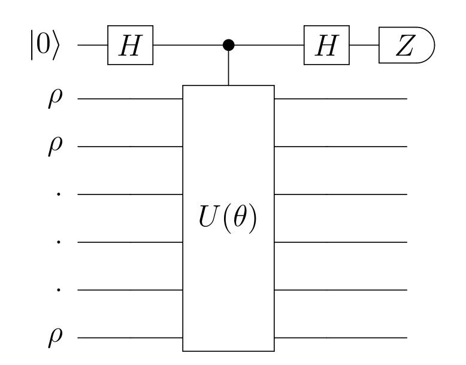
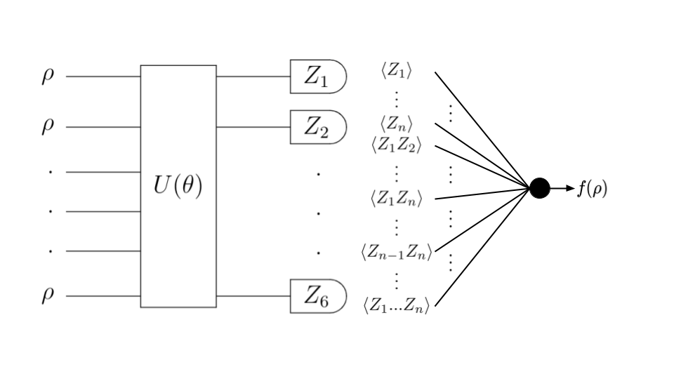
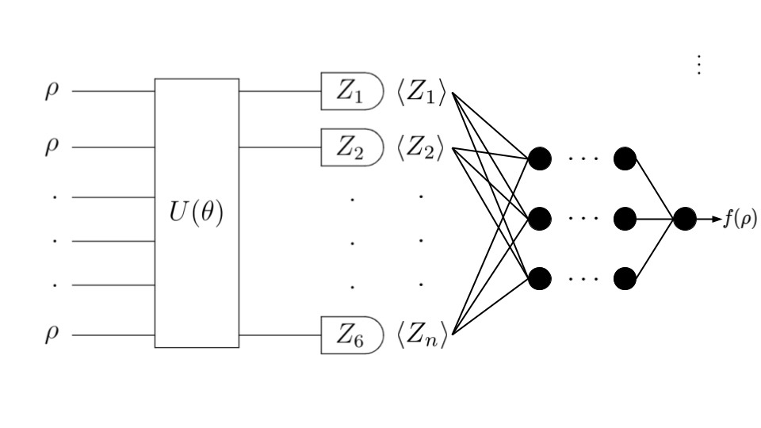

# Quantum Polynomial Network (PolyNet)

Code developed for my master's thesis [Learning quantum state properties with quantum and classical neural networks](http://www.diva-portal.org/smash/record.jsf?pid=diva2%3A1320072&dswid=6511), supervised by [Peter Wittek](https://peterwittek.com/) at the University of Toronto.

In this context, I considered and tested 3 quantum architectures to compute any property $f(\rho)$ of a quantum state $\rho$.

## State preparation

## PolyNet with ancilla

## PolyNet with correlations

## PolyNet with averages

